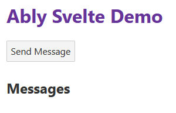

<!-- @import "[TOC]" {cmd="toc" depthFrom=1 depthTo=6 orderedList=false} -->

<!-- code_chunk_output -->

- [Using Ably with Svelte - Part 0 - Setup and configuration](#using-ably-with-svelte---part-0---setup-and-configuration)
  - [Considerations for Svelte](#considerations-for-svelte)
  - [Getting started with Svelte](#getting-started-with-svelte)
  - [Adding Ably to our Svelte app](#adding-ably-to-our-svelte-app)
- [Using Ably with Svelte - Part 1 Channels and Subscriptions](#using-ably-with-svelte---part-1-channels-and-subscriptions)
  - [Subscribing to a channel](#subscribing-to-a-channel)
    - [Cleaning up](#cleaning-up)
    - [Displaying messages](#displaying-messages)
  - [Token authentication](#token-authentication)
    - [Storing the api key in development](#storing-the-api-key-in-development)
    - [Creating an api endpoint](#creating-an-api-endpoint)
    - [Client-side code](#client-side-code)
- [Using Ably with Svelte - Part 2 - Using Channel Presence](#using-ably-with-svelte---part-2---using-channel-presence)
  - [What is Presence?](#what-is-presence)
  - [Our Code So Far](#our-code-so-far)
  - [Storing Presence Data](#storing-presence-data)
  - [Subscribing to Presence Events](#subscribing-to-presence-events)
  - [Adding to the UI](#adding-to-the-ui)
  - [Sending Presence Data](#sending-presence-data)
  - [The Full Code Sample](#the-full-code-sample)
- [Using Ably with Svelte - Part 3 - Ably Lifecycle Functions](#using-ably-with-svelte---part-3---ably-lifecycle-functions)
  - [Introducing Ably Lifecycle Functions](#introducing-ably-lifecycle-functions)
  - [Installation](#installation)
  - [Usage](#usage)
    - [useChannel](#usechannel)
    - [usePresence](#usepresence)
  - [Converting our app to use the Ably Svelte Lifecycle Functions](#converting-our-app-to-use-the-ably-svelte-lifecycle-functions)

<!-- /code_chunk_output -->


# Using Ably with Svelte - Part 0 - Setup and configuration

Svelte is a rapidly-increasing-in-popularity JavaScript framework for building web applications. It exists in a similar place to `React` and `Vue` - and approaches similar problems - "how can we make modern, reactive, web applications that are both easy to use, and easy to maintain".

Contrary to the two dominent frameworks, `Svelte` approaches this problem from another angle, from their own docs:

  > Svelte is a radical new approach to building user interfaces. Whereas traditional frameworks like React and Vue do the bulk of their work in the browser, Svelte shifts that work into a compile step that happens when you build your app.
  >
  > Instead of using techniques like virtual DOM diffing, Svelte writes code that surgically updates the DOM when the state of your app changes.

While not as popular as the behemoth that is `react`, `Svelte` is a rapidly growing with around 77k stars on `GitHub` and is [used in 306k projects](https://github.com/sveltejs/svelte/network/dependents?package_id=UGFja2FnZS0xODI4Mjc5NQ%3D%3D).

`Svelte` is a great tool for building web applications, but as with all of the modern `SPA`-style frameworks, we need to make sure we use the `Ably JavaScript SDK` effectively and play nicely with the reactive rendering built into the framework.

## Considerations for Svelte

We will be using Svelte version 5. While `svelte` is a compiler that generates vanilla JavaScript, it shares similarities with the other `React`-style frameworks. `Svelte` apps are all *reactive by default*, so we have to make sure our JavaScript SDK - which maintains open websockets connections to the Ably service - is used effectively.

To do this:

- We need to handle component mounting and unmounting
- We need to make sure our Ably code doesn't run on the server, where it makes no sense
- We need to make sure we correctly handle subscriptions and channel detachments, so we don't leak resources and use up our messaging limits

In this demo, we're going to use `Ably` to build a real-time application that allows us to send messages to a channel, and then display those messages in the UI.

The app will do the following things:

- Display messages received from the channel in a UL element
- Send a message to the channel when the user clicks a button

It's a lo-fi demo, but it contains all the moving parts of any other real-world app.

## Getting started with Svelte

`Svelte` has a [quickstart guide](https://svelte.dev/blog/the-easiest-way-to-get-started) that tells you to execute the following commands

```bash
npm create svelte@latest myapp
cd myapp
npm install
npm run dev
```

You can use `pnpm` or `yarn` for the last two steps if you prefer.

The first step will give you a series of options. This repository was created using the following options:

1. Which Svelte app template: "Skeleton project"
2. Add type checking with TypeScript: "Yes, using JavaScript JSDoc comments"
3. Select additional options: "Svelte 5 preview"

(it is a good idea to update the versions of the dependencies in the `package.json` file at this point.)

## Adding Ably to our Svelte app

We need one additional dependency to start building our `Ably` integration - the `ably` package from `npm`. Install the package from your terminal:

```bash
npm install ably --save
```

The `static/global.css` file has been manually added to `src/app.html`. This file contains some basic styles that will be used in the demo.


# Using Ably with Svelte - Part 1 Channels and Subscriptions

For the sake of demo we're going to use our Ably API key in our markup - in a real app, we'd need to get this from an API to do `token authentication`, and if we were using `SvelteKit` as an application framework, we'd want to create an `Endpoint` to manage our tokens.

Let's open the `/src/routes/+page.svelte` file and replace it with the contents of [`src/routes/examples/01/+page.svelte`](vscode://src/routes/examples/01/+page.svelte):

```html
<script>    
  let messages = $state([]);
</script>

<div class="App">
  <h1>Ably Svelte Demo</h1>
  <div>
    <button>Send Message</button>
  </div>

  <h2>Messages</h2>
  <ul>
    {#each messages as msg}
      <li>{msg.data.text}</li>
    {/each}
  </ul>
</div>

```

We can now launch our app with `npm run dev`

```bash
npm run dev
```

And our app will be served on `http://localhost:5173/` - and you'll see the UI.



## Subscribing to a channel

We're going to add some code to subscribe to an Ably channel, but we need to make sure we only execute our code in the DOM - once our application is mounted in a browser. `Svelte` implements `lifecycle functions` that let us hook into the mounting and rendering process - and we're going to use one called `onMount` - you can [read the offical docs if you'd like a deeper understanding](https://svelte.dev/docs#run-time-svelte-onmount).

`onMount` executes code when our component mounts, and if you return a function from your `onMount` callback, it'll run *that* when the component unmounts or updates.

**Note:** `onMount()` should be used instead of the `$effect()` rune when you are computing (initial) reactive values.

```html
<script>
  import { onMount } from "svelte";
  let messages = $state([]);

  onMount(() => {
      // code to run when component mounts

      return () => {
          // code to run when component unmounts
      };
  });
</script>
```

We're going to expand out our `onMount` call to initilise the `Ably JavaScript SDK`, and set the state variable `channel` as we'll need it later.

```html
<script>
  import { onMount } from "svelte";
  import * as Ably from "ably";

  let messages = $state([]);
  let channel = $state();

  onMount(() => {    
    const ably = new Ably.Realtime.Promise({
      key: "your-api-key-here",
      clientId: "someid",
    });
    
    channel = ably.channels.get("your-channel-name");

    return () => {
      // code to run when component unmounts
      channel?.unsubscribe(channel);
      channel?.detach();
    };
  });
</script>
```

Once we have our channel instance, we can both `publish` and `subscribe` to it - first, let's add a subscription.

```javascript  
const ably = new Ably.Realtime.Promise({
    key: "your-api-key-here",
    clientId: "someid",
});

channel = ably.channels.get("your-channel-name");

channel.subscribe((message) => {
    messages.push(message);
});
```

In this block of code, we're subscribing to all the messages that will be sent to the channel, and we're going to add them to our `messages` array.

Our `messages` array is **reactive by default** in `Svelte` - this means that when it is modified in our `$effect` rune, it will automatically update the DOM and re-render the app.

### Cleaning up

If we stopped here, **we would have a terrible bug in our code** that would cause our app to use up it's quota of messages quickly - because each time the app mounts, it's subscribing to our channel. This means every time a message arrives, we're adding an additional subscription, and we'll be adding subscriptions exponentially with each new message. This scenario will also happens when HMR (Hot Module Reloading) unmounts and remounts your component.

```javascript
  onMount(() => {    
    ....

    return () => {
      channel?.unsubscribe(channel);
      channel?.detach();
    };
  });
```

In our cleanup code, we're unsubscribing from our channel, and detaching the channel from `Ably`. We're now not leaking connections and using up our quotes unnecessarily. 


### Displaying messages

Our application will now correctly render any messages that arrive on our channel using the `Svelte` HTML loop from our first sample:

```html
<script>
    ...
</script>

<div class="App">
  <h1>Ably Svelte Demo</h1>
  <div>
    <button>Send Message</button>
  </div>

  <h2>Messages</h2>
  <ul>
    {#each messages as msg}
      <li>{msg.data.text}</li>
    {/each}
  </ul>
</div>
```

The `#each` block loops around the `messages` array, and for each message in the array, it renders a `li` element with the message's text. In order to support actually sending some messages, the UI needs to be updated with a clickable button.

```html
<h1>Ably Svelte Demo</h1>
<div>
  <button onclick={sendMessage}>Send Message</button>
</div>
...
```

`Svelte` uses the attribute syntax visible here to bind events to the UI. The button calls a function called `sendMessage` when it's clicked.

```javascript
const sendMessage = () => {
    channel.publish("test-message", { text: "message text" });
};
```

When added to our script block this function will use the `channel` that we created in the `onMount` callback to publish a message to the channel. The message type here is set to `test-message` and there's a little hardcoded text that matches what the UI code expects.

The completed [`+page.svelte`](vscode://src/routes/examples/02/+page.svelte) application looks like this:

```html
<script>
  import { onMount } from "svelte";
  import * as Ably from "ably";

  let messages = $state([]);
  let channel = $state();

  onMount(() => {
    const ably = new Ably.Realtime({
      key: "your-api-key-here",
      clientId: "someid",
    });

    channel = ably.channels.get("your-channel-name");

    channel.subscribe((message) => {
      messages.push(message);
    });

    return () => {
      channel?.unsubscribe(channel);
      channel?.detach();
    };
  });

  const sendMessage = () => {
    channel.publish("test-message", { text: "message text" });
  };
</script>

<div class="App">
  <h1>Ably Svelte Demo</h1>
  <div>
    <button onclick={sendMessage}>Send Message</button>
  </div>

  <h2>Messages</h2>
  <ul>
    {#each messages as msg}
      <li>{msg.data.text}</li>
    {/each}
  </ul>
</div>

```

And it works!

It's quite simple for our apps to use the channels from the Ably JavaScript SDK in `Svelte` - just so long as we make sure we clean up after ourselves.

## Token authentication

In a real-world application, you would not want to use your API key in the client-side code. Instead, you would use [token authentication](https://www.ably.io/documentation/rest/authentication/#token-authentication) to authenticate your clients. We're going to create an endpoint in our SvelteKit application to provide the token authentication values to our client-side application.

### Storing the api key in development

In development, you can store your API key in a `.env` file in the root of your project. This file should be added to your `.gitignore` file to prevent it from being committed to your repository.

```bash
# .env
ABLY_API_KEY=your-api-key-here
```

In Svelte you can access this value as:

```javascript
import { ABLY_API_KEY } from "$env/static/private";
```

which ensures that the value is never loaded in the client-side code.

On the server side this value will be read from the environment variables. Remember to use a different token for your production environment.

### Creating an api endpoint

In SvelteKit, you can create an endpoint to provide the token authentication values to your client-side application. This endpoint will be used to provide the token authentication values to your client-side application.

Create `src/routes/api/ably-auth/+server.js` (this will create an endpoint at `/api/ably-auth`):
User authentication and authorization is outside the scope of this readme. You can use the [Ably REST API](https://www.ably.io/documentation/rest/authentication) to generate a token for your client.

```javascript
import * as Ably from 'ably'
import {json} from '@sveltejs/kit'
import {ABLY_API_KEY} from '$env/static/private'

const rest = new Ably.Rest({key: ABLY_API_KEY})

export async function GET({request, params, locals}) {
    // TODO: authenticate the user, e.g.:
    // const session = await locals.auth()
    // if (!session) fail(401, {status: "error", msg: "not logged in"})
    // TODO: authorize the user for this action...

    const token_request = await rest.auth.createTokenRequest({
        clientId: 'your-client-id',
        capability: {
            // on all channels (*) give publish and subscribe permissions
            '*': ['publish', 'subscribe']
        }
    })
    return json(token_request)
```

You should limit the permissions and channels to the ones the client should have access to.

### Client-side code

In your client side code you need to change the `onMount` function to get the token from the url corresponding to the path of the handler we wrote above:

```javascript
  const ably = new Ably.Realtime({
      authUrl: '/api/ably-auth',    
  });
```


# Using Ably with Svelte - Part 2 - Using Channel Presence

In part 1, we built a small app to publish and subscribe to messages on a channel. In this post, we're going to expand on that app and add support for `Channel Presence`.

> Ably’s presence feature allows clients or devices to announce their presence on a channel. Other devices or services may then subscribe to these presence events (such as entering, updating their state, or leaving the channel) in real time using our realtime SDKs, or via the Ably Integrations.


## What is Presence?

[Presence is one of Ablys core features](https://ably.com/docs/core-features/presence) - it allows us to keep track of the number of people on a channel, and to know who is online and who isn't.

In addition to the presence events, we can attach a [Presence Member Data](https://ably.com/docs/rest/presence#member-data) to each of the clients - this member data can be used to instantly synchronise data between all clients on the same channel - and is great for things like "user is typing" indicators.

We're going to expand the code sample from part 1 in this series, adding a button that can be clicked to send some Presence Member Data.

## Our Code So Far

In part 1, we finished up with this single-component `Svelte` application:

```html
<script>
  import { onMount } from "svelte";
  import * as Ably from "ably";

  let messages = [];
  let channel = null;

  onMount(() => {
    const ably = new Ably.Realtime.Promise({
      key: "your-api-key-here",
      clientId: "someid",
    });

    channel = ably.channels.get("your-channel-name");

    channel.subscribe((message) => {
      messages = [...messages, message];
    });

    return () => {
      channel.unsubscribe(channel);
      channel.detach();
    };
  });

  const sendMessage = () => {
    channel.publish("test-message", { text: "message text" });
  };
</script>

<div class="App">
  <h1>Ably Svelte Demo</h1>
  <div>
    <button on:click={sendMessage}>Send Message</button>
  </div>

  <h2>Messages</h2>
  <ul>
    {#each messages as msg}
      <li>{msg.data.text}</li>
    {/each}
  </ul>
</div>
```

We're going to need to add some additional capabilities to make presence work. These are:

1. A new variable to store the presence data
2. Presence subscription and unsubscription code during `onMount`
3. HTML elements to display presence data
4. A HTML button to send presence data

## Storing Presence Data

The code needs modifying to add a variable called `presenceData` to store the presence data.

As the start of the script block, this extra delcaration is required:

```javascript
import { onMount } from "svelte";
import * as Ably from "ably";

let messages = [];
let presenceData = []; // New variable to store the presence data
let channel = null;

onMount(() => {
    ...
```

Because variables in `Svelte components` are `reactive` by default (see [Reactive Variables](https://svelte.dev/docs#component-format-script-2-assignments-are-reactive)), we can trigger a re-render of the page by changing the value of the variable.

## Subscribing to Presence Events

The `onMount` code needs to be extended to subscribe to the presence events using the Ably JavaScript SDK. Before the return statement in the `onMount` callback, the follow changes are required:

```javascript
  onMount(() => {
    ... // Omitted for brevity

    const updatePresence = async () => {
      presenceData = await channel.presence.get();
    };

    (async () => {
      channel.presence.subscribe("enter", updatePresence);
      channel.presence.subscribe("leave", updatePresence);
      channel.presence.subscribe("update", updatePresence);

      await channel.presence.enter("");
      presenceData = await channel.presence.get();
    })();

    return () => {
      ... // Omitted for brevity
    };
  });
```

This is quite a complicated block of code, but there's a method in the madness. `onMount` handlers in `Svelte` must return a function that can execute `synchronously`. Because the code requires the `await` keyword when the channel presence is entered, the code needs to be wrapped in a self-executing `async` function.

It's absolutely fine in this context, because we can tolerate presence being subscribed to asynchronously.

First, an `updatePresence` function is declared that assigns the `presenceData` variable whenever a presence event occurs. It may look like fetching the data from `Ably` in the code here - but presence data is already cached in the client due to the event triggering.

Next, we subscribe to each of the main presence events - `enter`, `leave`, and `update` and after the channel is entered, and initial presence data assigned.

These changes take care of subscribing to the presence events, but further changes need to be made to the `onUnmount` callback to unsubscribe from the presence events, so that the code doesn't repeatedly subscribe when new messages arrive and inadvertently use up message quotas.

```javascript
return () => {
    channel.presence.leave();
    channel.presence.unsubscribe("enter");
    channel.presence.unsubscribe("leave");
    channel.presence.unsubscribe("update");
    presenceData = [];

    channel.unsubscribe(channel);
    channel.detach();
};
```

Here you can see the `channel.presence` leave function is called to leave the channel on unmount, along with `unsubscribing` from the same three presence events that were subscribed to. Finally, the `presenceData` variable is reinitilised to an empty array.

With all these changes, the `onMount` callback now looks like this:

```javascript
  onMount(() => {
    const ably = new Ably.Realtime.Promise({
      key: "your-api-key-here",
      clientId: "someid",
    });

    channel = ably.channels.get("your-channel-name");

    channel.subscribe((message) => {
      messages = [...messages, message];
    });

    const updatePresence = async () => {
      presenceData = await channel.presence.get();
    };

    (async () => {
      channel.presence.subscribe("enter", updatePresence);
      channel.presence.subscribe("leave", updatePresence);
      channel.presence.subscribe("update", updatePresence);

      await channel.presence.enter("");
      presenceData = await channel.presence.get();
    })();

    return () => {
      channel.presence.leave();
      channel.presence.unsubscribe("enter");
      channel.presence.unsubscribe("leave");
      channel.presence.unsubscribe("update");
      presenceData = [];

      channel.unsubscribe(channel);
      channel.detach();
    };
  });
```


## Adding to the UI

We need to add two new UI elements to our `App.svelte` - a new button to update the presence data, and a new list to display the presence data.

Here, we can see a new button, with an `on:click` handler that's calling a function called `update` - we'll create this later.

```html
<div class="App">
  <h1>Ably Svelte Demo</h1>
  <div>
    <button on:click={sendMessage}>Send Message</button>
    <button on:click={() => update("hello")}>Update status to hello</button>
  </div>

  <h2>Messages</h2>
  ...
```

Next we'll add a second #each block to loop over our presence data - it's exactly the same as our previous one, we're just reading `msg.data` from the presence entry.

```html
  ...
  <h2>Messages</h2>
  <ul>
    {#each messages as msg}
      <li>{msg.data.text}</li>
    {/each}
  </ul>

  <h2>Present Clients</h2>
  <ul>
    {#each presenceData as msg}
      <li>{msg.clientId}: {msg.data}</li>
    {/each}
  </ul>
</div>
```

## Sending Presence Data

To finish up the work to connect presence data, the `update` function referenced in the `on:click` handler needs to be added. Here it's added below the existing `sendMessage` function.

```javascript
  const sendMessage = () => {
    channel.publish("test-message", { text: "message text" });
  };

  const update = (text) => {
    channel.presence.update(text);
  };
```

All the `update` function does is call `channel.presence.update`, using the same `channel` instance that was created in the `onMount` callback.

Presence data can be as simple as a text string, or can contain encoded `json` data - if the implementation is adjusted to parse the data when it's received.

## The Full Code Sample

The final `App.svelte` file now looks like this:

```html
<script>
  import { onMount } from "svelte";
  import * as Ably from "ably";

  let messages = [];
  let presenceData = [];
  let channel = null;

  onMount(() => {
    const ably = new Ably.Realtime.Promise({
      key: "your-api-key-here",
      clientId: "someid",
    });

    channel = ably.channels.get("your-channel-name");

    channel.subscribe((message) => {
      messages = [...messages, message];
    });

    const updatePresence = async () => {
      presenceData = await channel.presence.get();
    };

    (async () => {
      channel.presence.subscribe("enter", updatePresence);
      channel.presence.subscribe("leave", updatePresence);
      channel.presence.subscribe("update", updatePresence);

      await channel.presence.enter("");
      presenceData = await channel.presence.get();
    })();

    return () => {
      channel.presence.leave();
      channel.presence.unsubscribe("enter");
      channel.presence.unsubscribe("leave");
      channel.presence.unsubscribe("update");
      presenceData = [];

      channel.unsubscribe(channel);
      channel.detach();
    };
  });

  const sendMessage = () => {
    channel.publish("test-message", { text: "message text" });
  };

  const update = (text) => {
    channel.presence.update(text);
  };
</script>

<div class="App">
  <h1>Ably Svelte Demo</h1>
  <div>
    <button on:click={sendMessage}>Send Message</button>
    <button on:click={() => update("hello")}>Update status to hello</button>
  </div>

  <h2>Messages</h2>
  <ul>
    {#each messages as msg}
      <li>{msg.data.text}</li>
    {/each}
  </ul>

  <h2>Present Clients</h2>
  <ul>
    {#each presenceData as msg}
      <li>{msg.clientId}: {msg.data}</li>
    {/each}
  </ul>
</div>
```

There's a lot of functionality in ~75 lines of code here - but if this were a real application, there would likely be more involved processing of message data happening. At this point, the amount of code related to connecting to, and managing `Ably` connections and presence data dwarfs the rest of the application code.

In part 3, we'll introduce a new `npm` package of specially build `Ably Lifecycle Functions` to remove some of the complexity from this implementation, and make our application more maintainable again.

# Using Ably with Svelte - Part 3 - Ably Lifecycle Functions

In parts 1 and 2 of this series, we took a look at `Svelte`, and how to use the Ably JavaScript SDK alongside `Svelte` to implement realtime capabilities into a basic web app - it's recommended you read part 1, and part 2, otherwise the rest of this piece won't make much sense.

At the end of part 2, we were left with around ~75 lines of code, and a basic web app that uses Ably - but the application was rapidly approaching the point where almost all of it's code was related to managing an `Ably` connection, and this likely would be cause for concern in a real application.

There was also quite a lot of things for the programmer to remember to make sure that we used both `Svelte` and `Ably` correctly.

- We need to handle component mounting and unmounting
- We need to make sure our Ably code doesn't run on the server, where it makes no sense
- We need to make sure we correctly handle subscriptions and channel detachments, so we don't leak resources and use up our messaging limits

That's a lot of subtle things that a developer could get wrong - so instead of just writing the code to handle these things, we'll introduce a new `npm` package of specially build `Ably Lifecycle Functions` to remove some of the complexity from this implementation, and make our application more maintainable again. Better to solve the problem once.

We've done this before with our `@ably/react-hooks` package, and it solved a whole category of errors for implementors.

## Introducing Ably Lifecycle Functions

We're pleased to announce the release of the [Ably Lifecycle Functions](https://github.com/ably-labs/svelte-lifecycle-functions) package, which provides a set of functions that can be used to manage Ably connections and presence data in Svelte applications.

They're available on `npm` today, and their usage looks like this, in an `App.svelte` file:


```html
<script>
    import { useChannel } from "@ably-labs/svelte-lifecycle-functions";

    let messages = [];

    const [channel] = useChannel("your-channel-name", (message) => {
        messages = [...messages, message];
    });
</script>

<h2>Messages</h2>
<ul>
{#each messages as msg}
  <li>{msg.data.text}</li>
{/each}
</ul>
```

Using this package you can:

- Interact with Ably channels using a single function call.
- Send messages via Ably using the channel instances returned from that function
- Get notifications of user presence on channels
- Send presence updates

This package provide a simplified syntax for interacting with Ably, and manage the lifecycle of the Ably SDK instances for you taking care to subscribe and unsubscribe to channels and events when your componenets re-render.

## Installation

The functions ship as an ES6 module, so you can use the `import` syntax in your code.

```bash
npm install --save @ably-labs/svelte-lifecycle-functions
```

This works out of the box in the default Svelte starter templates from the REPL - and you can use the package immediately.

It is strongly recommended that you use [Token Authentication](https://www.ably.io/documentation/rest/authentication/#token-authentication), this will require server side code that is outside of the scope of this readme. In the examples below we use an API key directly in the markup, this is for ***local development only** and **should not be used for production code** and **should not** be committed to your repositories.

If you are using `SvelteKit`, you should keep your API key on the `server side` and create an [Endpoint](https://kit.svelte.dev/docs/routing#endpoints) to provide the `Token Authentication` values as a prop to your client side application.

## Usage

Once you've added the package using `npm` to your project, you can use the functions in your code.
First, we need to modify our Svelte `main.js` or `main.ts` file to configure the Ably SDK.

```javascript
import App from './App.svelte';
import { configureAbly } from "../lifecycle-functions";

configureAbly({ key: "your-api-key-here", clientId: "someid" });

var app = new App({
  target: document.body
});

export default app;
```

`configureAbly` matches the method signature of the Ably SDK - and requires either a `string` or an `AblyClientOptions`. You can use this configuration object to setup your API keys, or tokenAuthentication as you normally would. If you want to use the `usePresence` function, you'll need to explicitly provide a `clientId`.

You can do this anywhere in your code before the rest of the library is used.

### useChannel

The useChannel function lets you subscribe to a channel and receive messages from it.

```javascript
const [channel, ably] = useChannel("your-channel-name", (message) => {
    console.log(message);
});
```

**Both the channel instance, and the Ably JavaScript SDK instance are returned from the useChannel call.**

`useChannel` really shines when combined with a regular reactive assignment or store hook - for example, you could keep a list of messages in your app state, and use the `useChannel` hook to subscribe to a channel, updating the UI by assigning to the reactive property in your code when new messages arrive.

### usePresence

The usePresence hook lets you subscribe to presence events on a channel - this will allow you to get notified when a user joins or leaves the channel. You need to provide `usePresence` with a callback function to accept presence changes.

```javascript
let presenceData = [];
const [update] = usePresence("your-channel-name", (data) => {
    presenceData = data;
});
```

You can optionally provide a string when you `usePresence` to set an initial `presence data` string.

```javascript
const [update] = usePresence("your-channel-name", (data) => { ... }, "initial state");
```

The `update` function can be used to update the presence data for the current client:

```javascript
updateStatus("new status");
```

## Converting our app to use the Ably Svelte Lifecycle Functions

Using this package, we can convert our original source code from looking like this:

```html
<script>
  import { onMount } from "svelte";
  import * as Ably from "ably";

  let messages = [];
  let presenceData = [];
  let channel = null;

  onMount(() => {
    const ably = new Ably.Realtime.Promise({
      key: "your-api-key-here",
      clientId: "someid",
    });

    channel = ably.channels.get("your-channel-name");

    channel.subscribe((message) => {
      messages = [...messages, message];
    });

    const updatePresence = async () => {
      presenceData = await channel.presence.get();
    };

    (async () => {
      channel.presence.subscribe("enter", updatePresence);
      channel.presence.subscribe("leave", updatePresence);
      channel.presence.subscribe("update", updatePresence);

      await channel.presence.enter("");
      presenceData = await channel.presence.get();
    })();

    return () => {
      channel.presence.leave();
      channel.presence.unsubscribe("enter");
      channel.presence.unsubscribe("leave");
      channel.presence.unsubscribe("update");
      presenceData = [];

      channel.unsubscribe(channel);
      channel.detach();
    };
  });

  const sendMessage = () => {
    channel.publish("test-message", { text: "message text" });
  };

  const update = (text) => {
    channel.presence.update(text);
  };
</script>

<div class="App">
  <h1>Ably Svelte Demo</h1>
  <div>
    <button on:click={sendMessage}>Send Message</button>
    <button on:click={() => update("hello")}>Update status to hello</button>
  </div>

  <h2>Messages</h2>
  <ul>
    {#each messages as msg}
      <li>{msg.data.text}</li>
    {/each}
  </ul>

  <h2>Present Clients</h2>
  <ul>
    {#each presenceData as msg}
      <li>{msg.clientId}: {msg.data}</li>
    {/each}
  </ul>
</div>
```

To looking like this:

```html
<script>
  import { useChannel, usePresence } from "@ably-labs/svelte-lifecycle-functions";

  let messages = [];
  let presenceData = [];

  const [channel] = useChannel("your-channel-name", (message) => {
    messages = [...messages, message];
  });

  const [update] = usePresence("your-channel-name", (data) => {
    presenceData = data;
  });

  const sendMessage = () => {
    channel.publish("test-message", { text: "message text" });
  };
</script>

<div class="App">
  <h1>Ably Svelte Demo</h1>
  <div>
    <button on:click={sendMessage}>Send Message</button>
    <button on:click={() => update("hello")}>Update status to hello</button>
  </div>

  <h2>Messages</h2>
  <ul>
    {#each messages as msg}
      <li>{msg.data.text}</li>
    {/each}
  </ul>

  <h2>Present Clients</h2>
  <ul>
    {#each presenceData as msg}
      <li>{msg.clientId}: {msg.data}</li>
    {/each}
  </ul>
</div>
```

Removing all of the glue code concerned with configuring the Ably JavaScript SDK, and keeping the intent of your application front and centre.

We hope that this is a useful addition to your application, and we'd love to hear your feedback on it.

